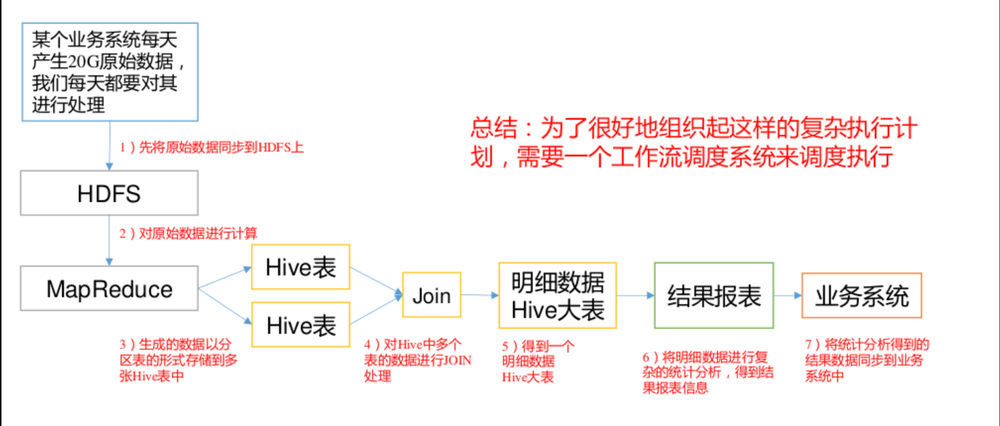

# 第 1 章 Azkaban 概论

## 1.1 为什么需要工作流调度系统

1）一个完整的数据分析系统通常都是由大量任务单元组成：

Shell 脚本程序，Java 程序，MapReduce 程序、Hive 脚本等

2）各任务单元之间存在时间先后及前后依赖关系

3）为了很好地组织起这样的复杂执行计划，需要一个工作流调度系统来调度执行；

**为什么需要工作流调度系统**



## 1.2 常见工作流调度系统

1）简单的任务调度：直接使用 Linux 的 Crontab 来定义；

2）复杂的任务调度：开发调度平台或使用现成的开源调度系统，比如 Ooize、Azkaban、Airflow、DolphinScheduler 等。

## 1.3 Azkaban 与 Oozie 对比

总体来说，Ooize 相比 Azkaban 是一个重量级的任务调度系统，功能全面，但配置使用也更复杂。如果可以不在意某些功能的缺失，轻量级调度器 Azkaban 是很不错的候选对象。

## 2.1 集群模式安装

### 2.1.1 上传 tar 包

1）将 azkaban-db-3.84.4.tar.gz，azkaban-exec-server-3.84.4.tar.gz，azkaban-web-server-3.84.4.tar.gz 上传到 hadoop102 的/opt/software 路径

```
[atguigu@hadoop102 software]$ ll
总用量 35572
-rw-r--r--. 1 atguigu atguigu 6433 4 月 18 17:24 azkaban-db-3.84.4.tar.gz
-rw-r--r--. 1 atguigu atguigu 16175002 4 月 18 17:26 azkaban-exec-server-3.84.4.tar.gz
-rw-r--r--. 1 atguigu atguigu 20239974 4 月 18 17:26 azkaban-web-server-3.84.4.tar.gz
```


2）新建/opt/module/azkaban 目录，并将所有 tar 包解压到这个目录下

```
[atguigu@hadoop102 software]$ mkdir /opt/module/azkaban
```


3）解压 azkaban-db-3.84.4.tar.gz、 azkaban-exec-server-3.84.4.tar.gz 和 azkaban-web-server-3.84.4.tar.gz 到/opt/module/azkaban 目录下

```
[atguigu@hadoop102 software]$ tar -zxvf azkaban-db-3.84.4.tar.gz -C /opt/module/azkaban/
[atguigu@hadoop102 software]$ tar -zxvf azkaban-exec-server-3.84.4.tar.gz -C /opt/module/azkaban/
[atguigu@hadoop102 software]$ tar -zxvf azkaban-web-server-3.84.4.tar.gz -C /opt/module/azkaban/
```


4）进入到/opt/module/azkaban 目录，依次修改名称

```
[atguigu@hadoop102 azkaban]$ mv azkaban-exec-server-3.84.4/ azkaban-exec
[atguigu@hadoop102 azkaban]$ mv azkaban-web-server-3.84.4/ azkaban-web 
```


### 2.1.2 配置 MySQL

1）正常安装 MySQL

2）启动 MySQL

```
[atguigu@hadoop102 azkaban]$ mysql -uroot -p000000
```

3）登陆 MySQL，创建 Azkaban 数据库

```
mysql> create database azkaban;
```

4）创建 azkaban 用户并赋予权限

设置密码有效长度 4 位及以上

```
mysql> set global validate_password_length=4;
```

设置密码策略最低级别

```
mysql> set global validate_password_policy=0;
```

创建 Azkaban 用户，任何主机都可以访问 Azkaban，密码是 000000

```
mysql> CREATE USER 'azkaban'@'%' IDENTIFIED BY '000000';
```

赋予 Azkaban 用户增删改查权限

```
mysql>GRANT SELECT,INSERT,UPDATE,DELETE 'azkaban'@'%' WITH GRANT OPTION;
```

5）创建 Azkaban 表，完成后退出 MySQL

```
mysql> use azkaban;
mysql> source /opt/module/azkaban/azkaban-db-3.84.4/create-all-sql-3.84.4.sql
mysql> quit;
```

6）更改 MySQL 包大小；防止 Azkaban 连接 MySQL 阻塞

```
[atguigu@hadoop102 software]$ sudo vim /etc/my.cnf
```

在[mysqld]下面加一行 max_allowed_packet=1024M

```
[mysqld]
max_allowed_packet=1024M
```

7）重启 MySQL

```
[atguigu@hadoop102 software]$ sudo systemctl restart mysqld
```

### 2.1.3 配置 Executor Server

Azkaban Executor Server 处理工作流和作业的实际执行。

1）编辑 azkaban.properties

```
[atguigu@hadoop102 azkaban]$ vim /opt/module/azkaban/azkaban-exec/conf/azkaban.properties

修改如下标红的属性
#...
default.timezone.id=Asia/Shanghai
#...
azkaban.webserver.url=http://hadoop102:8081
executor.port=12321
#...
database.type=mysql
mysql.port=3306
mysql.host=hadoop102
mysql.database=azkaban
mysql.user=azkaban
mysql.password=000000
mysql.numconnections=100
```

2）同步 azkaban-exec 到所有节点

```
[atguigu@hadoop102 azkaban]$ xsync /opt/module/azkaban/azkaban-exec
```

3）必须进入到/opt/module/azkaban/azkaban-exec 路径，分别在三台机器上，启动 executorserver

```
[atguigu@hadoop102 azkaban-exec]$ bin/start-exec.sh
[atguigu@hadoop103 azkaban-exec]$ bin/start-exec.sh
[atguigu@hadoop104 azkaban-exec]$ bin/start-exec.sh
```

注意：如果在/opt/module/azkaban/azkaban-exec 目录下出现 executor.port 文件，说明启动成功

4）下面激活 executor，需要

```
[atguigu@hadoop102 azkaban-exec]$ curl "hadoop102:12321/executor?action=activate" && echo -G
[atguigu@hadoop103 azkaban-exec]$ curl "hadoop103:12321/executor?action=activate" && echo -G
[atguigu@hadoop104 azkaban-exec]$ curl "hadoop104:12321/executor?action=activate" && echo -G
```

如果三台机器都出现如下提示，则表示激活成功

```
{"status":"success"}
```

### 2.1.4 配置 Web Server

Azkaban Web Server 处理项目管理，身份验证，计划和执行触发。

1）编辑 azkaban.properties

```
[atguigu@hadoop102 azkaban]$ vim /opt/module/azkaban/azkaban-web/conf/azkaban.properties
修改如下属性
...
default.timezone.id=Asia/Shanghai
...
database.type=mysql
mysql.port=3306
mysql.host=hadoop102
mysql.database=azkaban
mysql.user=azkaban
mysql.password=000000
mysql.numconnections=100
...
azkaban.executorselector.filters=StaticRemainingFlowSize,CpuStatus
```

说明：

\#StaticRemainingFlowSize：正在排队的任务数；

\#CpuStatus：CPU 占用情况

\#MinimumFreeMemory：内存占用情况。测试环境，必须将 MinimumFreeMemory 删除掉，否则它会认为集群资源不够，不执行。

2）修改 azkaban-users.xml 文件，添加 atguigu 用户

```
[atguigu@hadoop102 azkaban-web]$ vim /opt/module/azkaban/azkaban-web/conf/azkaban-users.xml
<azkaban-users>
	<user groups="azkaban" password="azkaban" roles="admin" username="azkaban"/>
	<user password="metrics" roles="metrics" username="metrics"/>
	<user password="atguigu" roles="admin" username="atguigu"/>
	<role name="admin" permissions="ADMIN"/>
	<role name="metrics" permissions="METRICS"/>
</azkaban-users>
```

3）必须进入到 hadoop102 的/opt/module/azkaban/azkaban-web 路径，启动 web server

```
[atguigu@hadoop102 azkaban-web]$ bin/start-web.sh
```

4）访问 [http://hadoop102:8081,并用](http://hadoop102:8081,并用/) atguigu 用户登陆